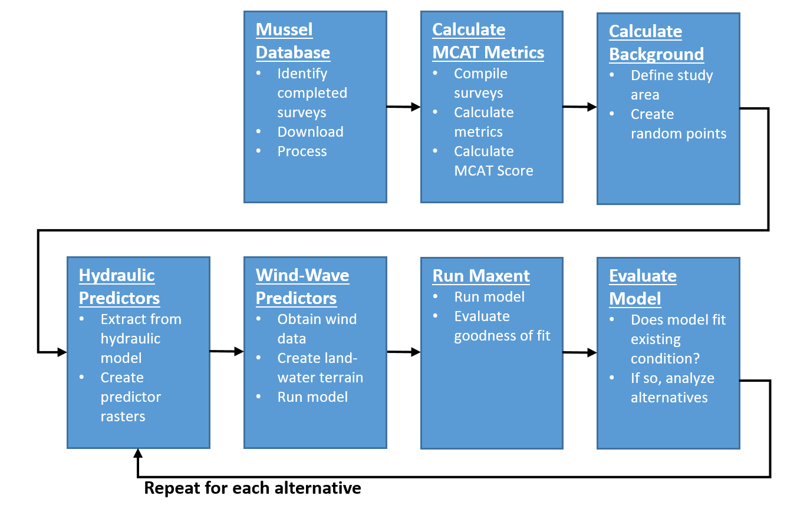

# Introduction
This chapter will provide an overview of the HREP mussel modeling process described in this technical report. 


## Need for the Study
Mussels are receiving increased attention in UMRR HREPs not only for the purpose of avoiding mussel habitat impacts from the construction of habitat features, but for designing restoration features that benefit mussels.  

* Mussels are important UMR biotic communities!
* Few methods exist for evaluating mussel habitat suitability for UMRR HREPs
* Spatially explicit models are helpful to evaluate spatial variation of habitat suitability across projects
* Evaluate impact of project features on existing mussel communities
* Evaluate likelihood that project features will create suitable habitat for mussels


## Species Distribution Modeling
Species Distribution Modeling (SDM) has become a common method for mapping suitable habitats for many species or taxa groups [@elith2008working, @elith2009species]. The spatially explicit nature of these models makes them extremely well suited for HREP design as they predict habitat suitability across the study area. The [Maxent](https://biodiversityinformatics.amnh.org/open_source/maxent/) software for modeling species niches and distributions [@phillips2017opening] has been used for modeling a wide range of species, taxa group, guilds, and communities [@merow2013practical]. 


## Previous UMR Mussel Modeling
* UMESC Pool 10 [@steuer2008use]
* UMESC Pool 8 [@zigler2008importance]
* UMESC Pool 8 mussel model [@newton2011population]
* UMESC Pool 18 mussel model [@zigler2012patterns]


Presence Data (dependent variables)

* Take advantage of existing UMR mussel data


Predictor Variables (independent variables)

* Many HREPs invest in 2D hydraulic models. Let’s use them!
* Mapping substrate is expensive
* Hydraulic only mussel models explain ~%60 of variation
* Is that good enough to make better informed HREP planning decisions?


## Workflow


```{r echo=FALSE, fig.cap="HREP Mussel Modeling Workflow."}

```


## Mussel Database
The USACE Mussel Database

HREP pre-project survey

* 2018 Steamboat survey
* 2014 Cordova survey
* 2010 Cordova survey


## Calculate MCAT Metrics


## Calculate Background


## Prepare Hydraulic Predictors


## Prepare Wind-Wave Predictors


## Run Maxent


## Evaluate Model


## Repeat for Each Alternative

