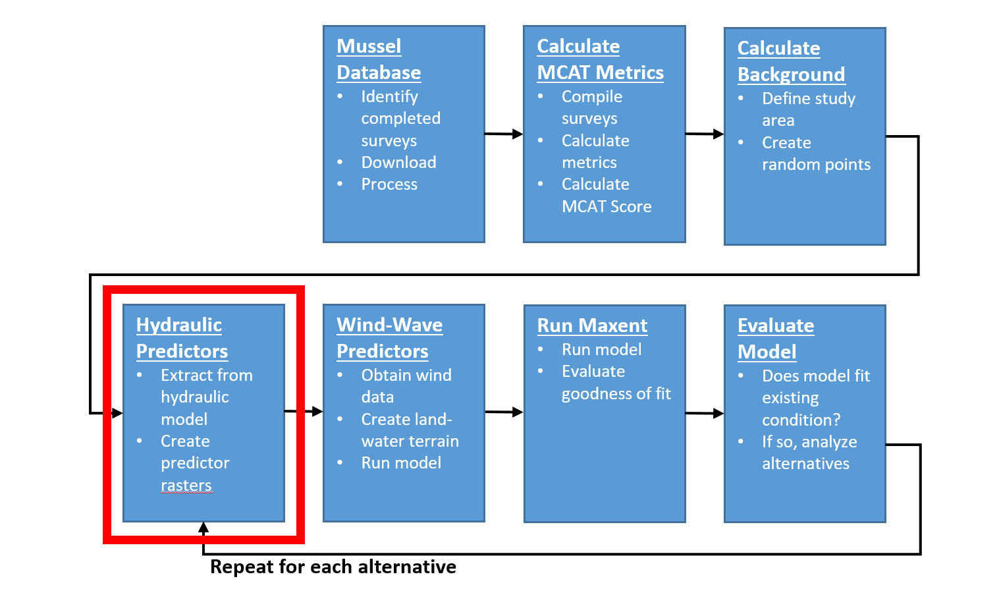

# Prepare Hydraulic Data
This chapter will describe the process used to prepare hydraulic modeling data for input to the Maxent model. For this study, the USACE developed Adaptive Hydraulics (AdH) 2D hydraulic model was used to model river dynamics. This chapter will describe how to process AdH outputs into usable datasets for mussel modeling. 

```{r echo=FALSE, fig.cap="HREP Mussel Modeling Workflow, Hydraulic Predictors Step."}

```

## Create Mask
The goal of this step is to define no data areas outside of the study. This step will use the UMRR Long Term Resource Monitoring (LTRM) decadal land cover mapping dataset to create a mask of the study area. 

* Create a new polygon feature class named: `\\mvrdfs\EGIS\Work\EMP\HREP_Projects\SteamboatSlough\Mussels\SteamboatMusselModel\Data\SB_Mussels.gdb\SB_ILStatePlaneW\study_area`.
* Start an edit session on the `study_area` feature class and draw a polygon around the study area. Ensure that this polygon entirely covers the study area. 
* Use the `Aquatic_Areas_2010` layer to prepare data for the Clip (Analysis) tool (`\\mvrdfs\egis\Data\Layers\Biology\Aquatic_Areas_2010.lyr`).

    * Input Features: `Aquatic Areas 2010\Classifications\Aquatic Areas: Level 2`
    * Clip Features: `study_area`
    * Output Feature Class: `\\mvrdfs\EGIS\Work\EMP\HREP_Projects\SteamboatSlough\Mussels\SteamboatMusselModel\Data\SB_Mussels.gdb\aquatic_areas`
    
* Delete "Isolated Floodplain Lake" records from the `aquatic_areas` attribute table.  
* Use the Dissolve (Data Management tool) `aquatic_areas` using 'LAND_WATER' as the dissolve field. 

    * Output feature class: `\\mvrdfs\EGIS\Work\EMP\HREP_Projects\SteamboatSlough\Mussels\SteamboatMusselModel\Data\SB_Mussels.gdb\aquatic_areas_dissolve`
    * Create multipart features: uncheck box  
    
* Open an edit session to edit the `aquatic_areas_dissolve` attribute table. Select the row where 'LAND_WATER' field is set to Land, and delete.
* Run the Multipart to Singlepart Tool (Data Management) on `aquatic_areas_dissolve`. Name the feature class `aquatic_areas_dissolve_singlepart`.
* Turn on `topobathy` and use it as a guide to edit out areas where where it is too shallow in the `aquatic_areas_dissolve_singlepart` feature class. Be sure to merge the polygons before saving edits and delete intermediates `aquatic_areas_dissolve` and `aquatic_areas_dissolve_singlepart`.
* Use the Buffer (Analysis) tool to expand  the study area beyond the extent of valid values. This expanded area will be used to define no data portions of the modeled Adh values.

    * Input features: `aquatic_areas`
    * Output Feature Class: `\\mvrdfs\egis\Work\EMP\HREP_Projects\SteamboatSlough\Mussels\SteamboatMusselModel\Data\SB_Mussels.gdb\SB_ILStatePlaneW\aquatic_areas_20m`
    * Distance: 20 meters
    
* Use the Polygon to Raster (Conversion) tool to convert the `aquatic_areas_20m` feature class to a raster.

    * Input Features: `aquatic_areas_20m`
    * Value field: `OBJECTID`
    * Output Raster Dataset: `\\mvrdfs\egis\Work\EMP\HREP_Projects\SteamboatSlough\Mussels\SteamboatMusselModel\Adh\Existing_condition\existingcondition.gdb\mask`
* Set Environments

    * Ouput Coordinates: `NAD_1983_2011_StatePlane_Illinois_West_FIPS_1202_Ft_US`
    * Processing Extent: `study_area`
    * Cell Size: 3 ft

## Set Environments
The purpose of this step is to set the Environments to `mask` so that all the subsequent Adh raster outputs will have the same coordinate system, extent, cell alignment, cell size, and no data area.
*Set Environments

    * Ouput Coordinates: `mask`
    * Processing Extent: `mask`
    * Snap raster: `mask`
    * Cell Size: `mask`
    * Mask: `mask`

## Process ADH Model Outputs
The goal of this step is to convert the raw Adaptive Hydraulics Model (Adh) data (depth, slope velocity, sheer stress, froude_number, reynolds_number) into raster format that can be input to the Maxent model. Adh models will be produced for the Q5 (high flow) and Q95 (low flow) flow conditions. This wil result in the creation of 12 raster (one for each of 6 Adh parameter) by 2 flow conditions. 

* Create a new folder and geodatabase to represent the alternative that this Adh model represents. In this example we will be modeling the existing condition alternative: `\\mvrdfs\egis\Work\EMP\HREP_Projects\SteamboatSlough\Mussels\SteamboatMusselModel\Adh\Existing_condition/existingcondition.gdb`
* Get the Adh output from the hydraulic engineer. Copy it to the alternative folder you created in the last step. EC-HH Working directory: `\\mvr-netapp2\MVRDATA\ED\ec-hh\Mississippi_River\Steamboat Island\AdH\Model Runs\`
* Use Excel to convert the space-delimited `.txt` file to `.csv`. Open a blank Excel workbook and open the `.txt` file. Use the import wizard to convert the space-delimited file into an Excel workbook. Ensure the import works correctly, delete any header information above the row of field names, and then save as a `.csv` file. 
* Import the `.csv` file into the `existingcondition` geodatabase. Name the table by the flow condition it represents (Q5, Q95). Ensure that the field types are all set to `double`. 
* Add the Q5 table into a blank ArcMap document. 
* Right-click the `Q5` table and click "Display XY Data".
* Set appropriate 'X','Y', and 'Z' fields.
* Identify the datum and coordinate system recorded in the Adh table; all future output feature classes and rasters will need to be in the same projected coordinate system. In this example, Datum: 'NAD 1983 2011 US Feet' and Coordinate System: 'StatePlane Illinois West FIPS 1202'.
* Export `Q5_Events` as new point feature class named `Q5_pts`.
* Repeat the above steps to create point feature classes for the Q95 model results. 
* Use the IDW (Spatial Analyst) tool to interpolate a raster surface.

    * Input point features: `Q5_pts`. 
    * Z value field: velocity
    * Output raster: `\\mvrdfs\EGIS\Work\EMP\HREP_Projects\SteamboatSlough\Mussels\SteamboatMusselModel\Adh\Existing_condition\existingcondition.gdb\q5_velocity`
    
* Complete these steps for the other variables, `dept`, `slope`, and `sheer stress`, `froude_number`, `reynolds_number`.


## Calculate Slope
The goal of the step is to calculate slope from the Adh depth variable created in the previous step.

* Use the Slope (Spatial Analyst) tool to calculate slope.

    * Input raster: `q5_depth`
    * Output raster: `\\mvrdfs\egis\Work\EMP\HREP_Projects\SteamboatSlough\Mussels\SteamboatMusselModel\Adh\Existing_condition\existingcondition.gdb\q5_slope`
    * Output measurement: degree
    * Z factor = 1 (linear units same)
    
* Use Copy Raster (Data Management) tool to convert the `q5_slope` raster into .bil format, as outlined in previous step.
* Repeat the above steps to conver calculate the Q95 slope.  


## Convert to .bil format
The goal of this step is to convert the Adh output into a format that can be used by Maxent. The .bil format is one of the formats common to both Maxent and Esri. This step will repeated for all Adh (Q5, Q95) predictors.

* Use the Copy Raster (Data Management) tool to covert the Adh predictor rasters into .bil format.

    * Input Raster: `q5_velocity`
    * Output Raster Dataset: `\\mvrdfs\egis\Work\EMP\HREP_Projects\SteamboatSlough\Mussels\SteamboatMusselModel\Adh\Existing_condition\q5_velocity.bil` (Note: cannot save .bil format within the .gdb)
    * Format: Esri BIL

* Repeat the above step for all of the other environmental predictor variables. 

