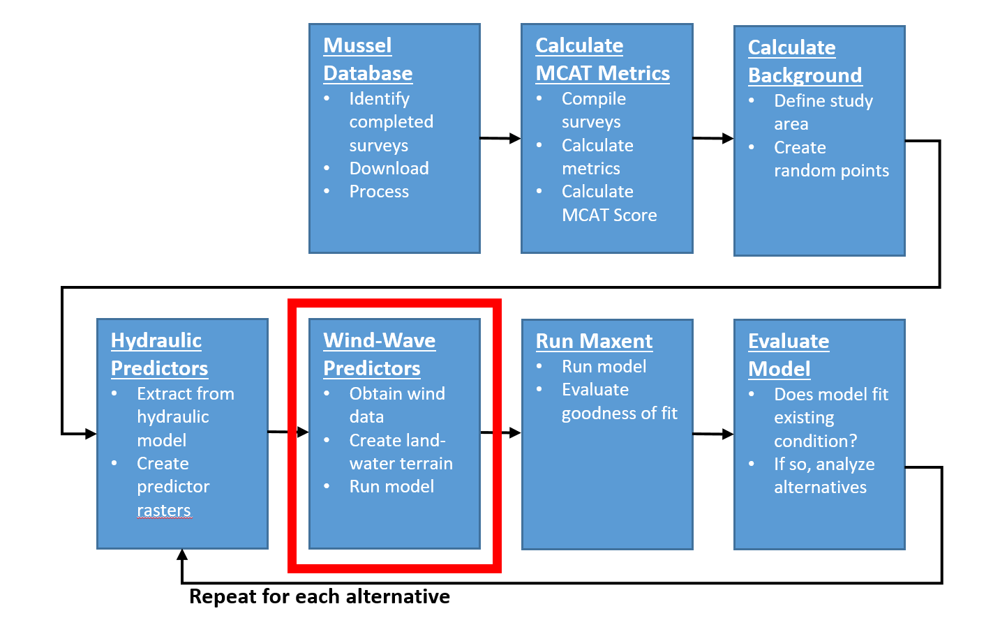

# Prepare Wind and Wave Data
This chapter will describe the process used to conduct a wind and wave model using the Upper Mississippi River Environmental Science Center (UMESC) [Wind-Wave Model](https://umesc.usgs.gov/management/dss/wind_fetch_wave_models_2012update.html) [@Rohweder2012] to prepare hydraulic modeling data for input to the Maxent model. 

```{r echo=FALSE, fig.cap="HREP Mussel Modeling Workflow, Wind-Wave Step."}

```

## Identify Appropriate Weather Stations

## Obtain Wind Data

## Determine Period of Record


