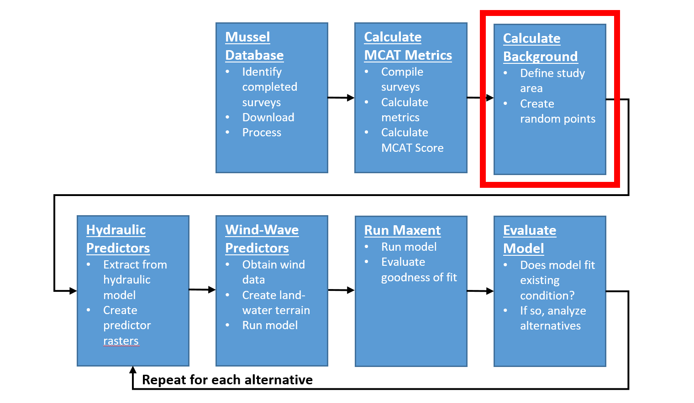

# Create Backgound Data
This chapter will describe the process used to calculate background data for input to the Maxent model. Background point data are used to define the habitat available within to mussels within the study area.  

```{r echo=FALSE, fig.cap="HREP Mussel Modeling Workflow, Calculate Background Step."}

```

## Create Background Data
Create a background to constrain points to aquatic areas (more data resolution) and reduce Maxent run times.

* Use the Create Random Points (Data Management) tool to create a background restricted to aquatic areas:

    * Output location: `\\mvrdfs\EGIS\Work\EMP\HREP_Projects\SteamboatSlough\Mussels\SteamboatMusselModel\Data\SB_Mussels.gdb\`
    * Output feature class: `background`
    * Constraining feature class:`aquatic_areas_5m`
    * Number of points: 10000
    * Mininum allowed distance: 25m
    * Leave all others as defaults
    * Click Ok to run the tool

* In the `background` feature class, add 3 fields one named `species` Type = Text and Length=20; one named `longitude` Type = Double; and one named `latitude` Type = Double. 
* For the `species` field use field calculator to set the value of the field to `species` = "background". 
* Use the Calculate Geometry tool to populate the `longitude` and `latitude` fields, ensuring that the coordinate system is set to `NAD 1983 2011 US Feet` and `StatePlane Illinois West FIPS 1202` and the units are set to `US feet`. 


## Export to Maxent "SWD" Format
The purpose of this step is to assign the ADH environmental predictor variables (and optionally the wind/wave variables) to background point. The Maxent documentation refers to this format as the "Samples With Data" (SWD) format because it contains the samples (i.e., sample identifier, latitude, longitude) with the environmental predictor variables (e.g., q5_velocity, q5_depth, q5_slope, etc.). 

* Use Extract Multi Values to Points (spatial analyst) tool to write new values (velocity, depth, slope, and ss) onto feature classes `unionidae_swd` and `background`.

     * Input point features: `\\mvrdfs\EGIS\Work\EMP\HREP_Projects\SteamboatSlough\Mussels\SteamboatMusselModel\Data\SB_Mussels.gdb\background`
     * Input rasters: velocity, depth, slope, and ss (use rasters in the `Adh.gdb`, not .bil)  copy unionidae_swd and delete 3 variable fields. Ensure all layers have same spatial reference before running the tool. Copy .gdb on local drive prior to running Maxent.
     
* Ensure all layers have same spatial reference before running the tool.  
* May have to run Project (Data Mgmt) tool on the `unionidae_swd` points feature class prior to running Multi Values to Points tool. 
* Export `background` and each mussel metric as .csv files. Ensure ObjectID field is deleted in Excel prior to upload in Maxent.


