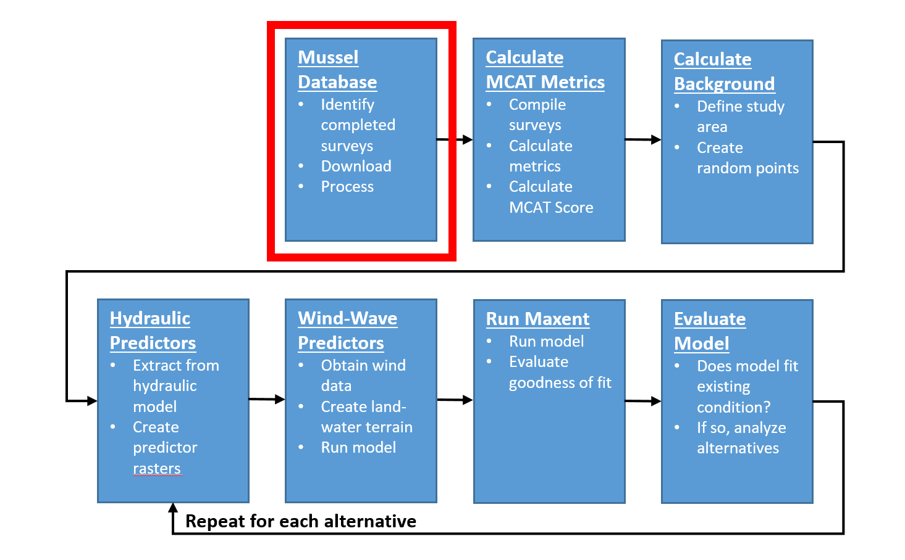

# Mussel Data Processing
This chapter will describe the process used to prepare mussel occurrence data for input to the Maxent model. This analysis makes heavy use of the mussel surveys recorded in the [USACE Mussel Database](https://rsgisias.crrel.usace.army.mil/intro/mussels_dev.pub.main). 

```{r echo=FALSE, fig.cap="HREP Mussel Modeling Workflow, Mussel Database Step."}

```


## Identify Mussel Surveys in Study Area
The purpose of this step is to identify appropriate mussel surveys completed for the study area. 

<<add further mussel survey identification instructions here>>


## Import Sample Locations
The purpose of this step is to import sample locations from the USACE Mussel Database. 

* Working geodatabase: `//mvrdfs/EGIS/Work/EMP/HREP_Projects/SteamboatSlough/Mussels/SteamboatMusselModel/Data/SB_Mussels.gdb/SB_ILStatePlaneW`
* Import sample location point feature class for each survey. This feature class contains the feature geometry for each sampled location. 
* Add `double` fields `Northing` and `Easting` and calculate geometry for each sample location point feature class.


## Import Individual Mussel Records
The purpose of this step is to import individual mussel records from the USACE mussel Database. 

* Import "individual" data tables for each survey to the working geodatabase. These tables contain records for individual mussels. 
* Add `double` fields `Northing` and `Easting` to each mussel tabular data. 
* Add a text field `Method` 

## Join Sample Location to Individual Mussel Records
The purpose of this step is to join the individual mussel records to the sample locations. 

* Join the sample location point feature class to each mussel tabular data. Directionality of join is important: right-click mussel tabular data and select join, using `SAMPLEID` as join field.
* Calculate geometry `Northing` and `Easting` from the sample location point feature class.
* Field calculate `Method` from the sample location point feature class using `COLLECT_METHOD` field (i.e., `Method` = `COLLECT_METHOD`).
* Remove the join. 
* Use the "Display XY" tool to create events from the mussel tabular data. 
* Export the events to the geodatabase as: `Cordova_YEAR`
* Create 2 new fields (type: long integer) titled `NumberLive` and `NUM5YEAR`.
* Use field calculator to populate each field with '0' indicating absence and '1' for presence in each new field (`NumberLive` and `NUM5YEAR` (number less than or equal to 5 years).

## Repeat for each mussel survey in the study area
The purpose of this step is to repeat the above three steps for each of the other mussel survey events within the study area. 

* Repeat the previous three steps for each mussel survey. 


## Append Surveys together into a single Study Area feature class
The purpose of this step is to assemble the "individual" data for each of the surveys within the study area that will be used in the study. 

* Append all three datasets into one feature class in the .gdb called `Cordova`.  Right-click this feature class and select 'load'. 

<<add further load instructions here>>


## Create a quantitative table
The purpose of this step is to create the `Cordova_all_individuals` feature class using a definition query on the `Cordova` feature class to only select quantitative samples.

* Using the `Cordova` feature class, create a definition query where `Method` = 'Quantitative' OR `EName`!= "No unionids".
* Export the selected records from the `Cordova` feature class and name this new feature class `Cordova_all_individuals`. 


## Create MCAT Flag Fields
The purpose of this step is to create a series of MCAT flag fields to indicate which individual mussel records meet each MCAT metrics. This flag field will be set in the next chapter. 

* Create "flag" fields to indicate that mussel individuals fall into certain categories. Add the following fields (Type=long integer) to the `Cordova_all_individuals` attribute table: `Listed`, `Tolerant`, `Lampsilini`, `Juveniles`, `Over_15yrs`, `tribe` 
* Use the Field Calculator tool on each of the fields that were created in the last step to set the value of all records to zero. 


## Create the `samples` table
The purpose of this step is to create a feature class representing the sampled sites. 

* Create a definition query on the `Cordova_all_individuals` feature class where `NumberLive > 0
* Create a table of SampleID. Use the `Dissolve` tool:
    * Input Features: `Cordova_all_individuals`
    * Output feature class: `samples`
    * Dissolve Fields: `SampleID`
    * Statistics Fields: `NumberLive`, SUM
    * Create Multipart: unchecked

