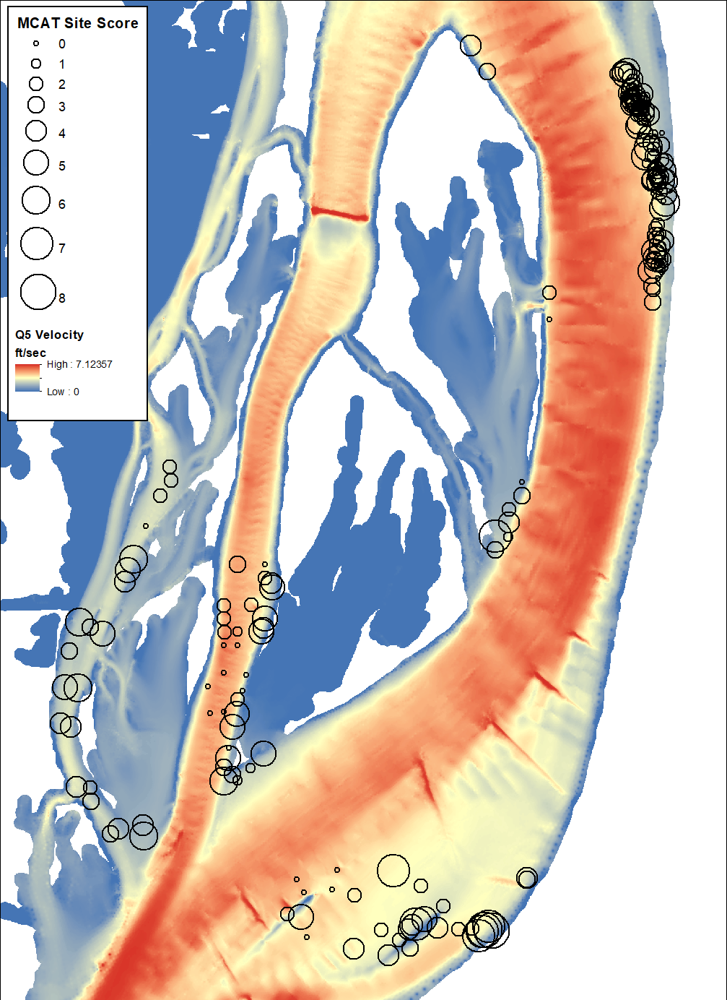

# Explore MCAT Metrics

## Explore MCAT Metrics by Environmental Predictors
The purpose of this step is to explore relationships between the MCAT metrics and the hypothesized environmental predictors. 

```{r message=FALSE, warning=FALSE, include=FALSE}
# Load libraries
library(sp)
library(ggplot2)
library(dplyr)
library(tidyr)
library(knitr)
library(kableExtra)
library(arcgisbinding)

# Check for ArcGIS license
arc.check_product()

# Define some ArcGIS helper functions

# Converts ArcGIS feature class to an sp object
arc2sp <- function(fc_path) {
  # Open a connection to the specified ArcGIS feature class
  arcobj <- arcgisbinding::arc.open(fc_path)
  # Select the ArcGIS data
  arc <- arcgisbinding::arc.select(arcobj)
  # Convert the ArcGIS format to the sp format
  sp <- arcgisbinding::arc.data2sp(arc)
}

# Converts an sp object to an ArcGIS feature class
sp2arc <- function(sp_object, fc_path) {
  # Convert the sp object to an ArcGIS data object
  arcobj <- arcgisbinding::arc.sp2data(sp_object)
  # Write the ArcGIS object to a geodatabase feature class
  arcgisbinding::arc.write(data = arcobj, path = fc_path)
}
```


```{r message=FALSE, warning=FALSE, include=FALSE}
# Import ArcGIS feature class into R
samples_mcat_sp <- arc2sp("//mvrdfs/EGIS/Work/EMP/HREP_Projects/SteamboatSlough/Mussels/SteamboatMusselModel/Data/SB_Mussels.gdb/SB_ILStatePlaneW/samples_mcat")

# Convert sp object to a data frame
samples_mcat <- samples_mcat_sp@data

```

```{r message=FALSE, warning=FALSE, include=FALSE}
# Import ArcGIS feature class into R
background_sp <- arc2sp("//mvrdfs/EGIS/Work/EMP/HREP_Projects/SteamboatSlough/Mussels/SteamboatMusselModel/Data/SB_Mussels.gdb/background")

# Convert sp object to a data frame
background <- background_sp@data

```

```{r message=FALSE, warning=FALSE, include=FALSE}
# Create a data frame for graphing MCAT Site Scores with background
## Select just the needed field
samples_mcat_graph <- samples_mcat[, c("mcat_site_score", "q5_velocity", 
                                       "q5_ss", "q5_reynolds", "q5_froude", 
                                       "q5_depth", "q5_slope",  "q95_velocity", 
                                       "q95_ss", "q95_reynolds", "q95_froude", 
                                       "q95_depth", "q95_slope")]
## Convert `mcat_site_score` to a factor
samples_mcat_graph$mcat_site_score <- factor(samples_mcat_graph$mcat_site_score)

## Create an `mcat_site_score` field
background$mcat_site_score <- rep("background", times = nrow(background))

## Select just the needed fields
backgound_graph <- background[, c("mcat_site_score", "q5_velocity", 
                                  "q5_ss", "q5_reynolds", "q5_froude", 
                                  "q5_depth", "q5_slope",  "q95_velocity", 
                                  "q95_ss", "q95_reynolds", "q95_froude", 
                                  "q95_depth", "q95_slope")]

# Combine samples_mcat and background
mcat_background <- rbind(samples_mcat_graph, backgound_graph)
mcat_background$mcat_site_score <- factor(mcat_background$mcat_site_score, 
                                          levels = c("background", "0", "1", "2", 
                                                     "3", "4", "5", "6", "7", "8"),
                                          ordered = TRUE)

# Convert from wide to long format for graphing
mcat_background_long <- gather(mcat_background, 
                               key = "predictor",
                               value = "value",
                               q5_velocity, q5_ss, q5_reynolds, q5_froude, 
                               q5_depth, q5_slope,  q95_velocity, 
                               q95_ss, q95_reynolds, q95_froude, 
                               q95_depth, q95_slope)
```

## MCAT Site Score by Velocity
```{r echo=FALSE, fig.cap="MCAT Site Scores with Velocity."}

```


```{r echo=FALSE, fig.height=4, fig.width=6.5}
ggplot(mcat_background_long[mcat_background_long$predictor == "q5_velocity", ], 
       aes(mcat_site_score, value)) + 
  geom_boxplot(varwidth = FALSE, outlier.shape = 1) + 
  theme_bw() +
  labs(x = "MCAT Site Score", y = "Q5 Velocity (ft/sec)")
```

```{r echo=FALSE, fig.height=4, fig.width=6.5}
ggplot(mcat_background_long[mcat_background_long$predictor == "q95_velocity", ], 
       aes(mcat_site_score, value)) + 
  geom_boxplot(varwidth = FALSE, outlier.shape = 1) + 
  theme_bw() +
  labs(x = "MCAT Site Score", y = "Q95 Velocity (ft/sec)")
```


## MCAT Site Score by Shear Stress
```{r echo=FALSE, fig.height=4, fig.width=6.5}
ggplot(mcat_background_long[mcat_background_long$predictor == "q5_ss", ], 
       aes(mcat_site_score, value)) + 
  geom_boxplot(varwidth = FALSE, outlier.shape = 1) + 
  theme_bw() +
  labs(x = "MCAT Site Score", y = "Q5 Shear Stress (Pa)")
```

```{r echo=FALSE, fig.height=4, fig.width=6.5}
ggplot(mcat_background_long[mcat_background_long$predictor == "q95_ss", ], 
       aes(mcat_site_score, value)) + 
  geom_boxplot(varwidth = FALSE, outlier.shape = 1) + 
  theme_bw() +
  labs(x = "MCAT Site Score", y = "Q95 Shear Stress (Pa)")
```

## MCAT Site Score by Reynolds Number
```{r echo=FALSE, fig.height=4, fig.width=6.5}
ggplot(mcat_background_long[mcat_background_long$predictor == "q5_reynolds", ], 
       aes(mcat_site_score, value)) + 
  geom_boxplot(varwidth = FALSE, outlier.shape = 1) + 
  theme_bw() +
  labs(x = "MCAT Site Score", y = "Q5 Reynolds number")
```

```{r echo=FALSE, fig.height=4, fig.width=6.5}
ggplot(mcat_background_long[mcat_background_long$predictor == "q95_reynolds", ], 
       aes(mcat_site_score, value)) + 
  geom_boxplot(varwidth = FALSE, outlier.shape = 1) + 
  theme_bw() +
  labs(x = "MCAT Site Score", y = "Q95 Reynolds number")
```

## MCAT Site Score by Froude Number
```{r echo=FALSE, fig.height=4, fig.width=6.5}
ggplot(mcat_background_long[mcat_background_long$predictor == "q5_froude", ], 
       aes(mcat_site_score, value)) + 
  geom_boxplot(varwidth = FALSE, outlier.shape = 1) + 
  theme_bw() +
  labs(x = "MCAT Site Score", y = "Q5 Froude number")
```

```{r echo=FALSE, fig.height=4, fig.width=6.5}
ggplot(mcat_background_long[mcat_background_long$predictor == "q95_froude", ], 
       aes(mcat_site_score, value)) + 
  geom_boxplot(varwidth = FALSE, outlier.shape = 1) + 
  theme_bw() +
  labs(x = "MCAT Site Score", y = "Q95 Froude number")
```

## MCAT Site Score by Depth
```{r echo=FALSE, fig.height=4, fig.width=6.5}
ggplot(mcat_background_long[mcat_background_long$predictor == "q5_depth", ], 
       aes(mcat_site_score, value)) + 
  geom_boxplot(varwidth = FALSE, outlier.shape = 1) + 
  theme_bw() +
  labs(x = "MCAT Site Score", y = "Q5 Depth (feet)")
```

```{r echo=FALSE, fig.height=4, fig.width=6.5}
ggplot(mcat_background_long[mcat_background_long$predictor == "q95_depth", ], 
       aes(mcat_site_score, value)) + 
  geom_boxplot(varwidth = FALSE, outlier.shape = 1) + 
  theme_bw() +
  labs(x = "MCAT Site Score", y = "Q95 Depth (feet)")
```

## MCAT Site Score by Slope
```{r echo=FALSE, fig.height=4, fig.width=6.5}
ggplot(mcat_background_long[mcat_background_long$predictor == "q5_slope", ], 
       aes(mcat_site_score, value)) + 
  geom_boxplot(varwidth = FALSE, outlier.shape = 1) + 
  theme_bw() +
  labs(x = "MCAT Site Score", y = "Q5 Slope (percent)")
```

```{r echo=FALSE, fig.height=4, fig.width=6.5}
ggplot(mcat_background_long[mcat_background_long$predictor == "q95_slope", ], 
       aes(mcat_site_score, value)) + 
  geom_boxplot(varwidth = FALSE, outlier.shape = 1) + 
  theme_bw() +
  labs(x = "MCAT Site Score", y = "Q95 Slope (percent)")
```


```{r message=FALSE, warning=FALSE, include=FALSE}
samples_mcat_summary <- samples_mcat %>% 
                        group_by(mcat_site_score) %>% 
                        summarize(q5_velocity_mean = mean(q5_velocity), 
                                  q5_ss_mean       = mean(q5_ss),
                                  q5_reynolds_mean = mean(q5_reynolds),
                                  q5_froude_mean   = mean(q5_froude),
                                  q5_depth_mean    = mean(q5_depth),
                                  q5_slope_mean    = mean(q5_slope),
                                  q95_velocity_mean = mean(q95_velocity), 
                                  q95_ss_mean       = mean(q95_ss),
                                  q95_reynolds_mean = mean(q95_reynolds),
                                  q95_froude_mean   = mean(q95_froude),
                                  q95_depth_mean    = mean(q95_depth),
                                  q95_slope_mean    = mean(q95_slope))
```

```{r message=FALSE, warning=FALSE, include=FALSE}
background_summary <- background %>% 
                      group_by(species) %>% 
                      summarize(q5_velocity_mean = mean(q5_velocity), 
                                q5_ss_mean       = mean(q5_ss),
                                q5_reynolds_mean = mean(q5_reynolds),
                                q5_froude_mean   = mean(q5_froude),
                                q5_depth_mean    = mean(q5_depth),
                                q5_slope_mean    = mean(q5_slope),
                                q95_velocity_mean = mean(q95_velocity), 
                                q95_ss_mean       = mean(q95_ss),
                                q95_reynolds_mean = mean(q95_reynolds),
                                q95_froude_mean   = mean(q95_froude),
                                q95_depth_mean    = mean(q95_depth),
                                q95_slope_mean    = mean(q95_slope))
```

