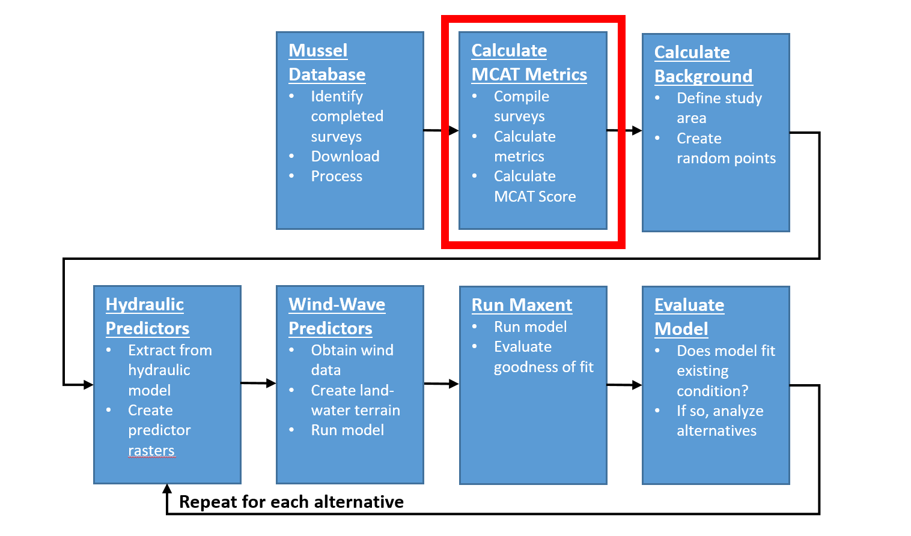

# Calculate Mussel Metrics
This chapter will describe how to calculate metrics of habitat quality for each sampled site. Each of these metrics will be used as presence data as input to create a set of Maxent habitat suitability models. The metrics calculated in this section were taken from the [Upper Mississippi River Mussel Community Assessment Tool (MCAT)](https://acwi.gov/monitoring/conference/2014/2ConcurrentSessions/J2/J2Dunn.pdf) [@dunn2016].

```{r echo=FALSE, fig.cap="HREP Mussel Modeling Workflow, Calculate MCAT Metrics Step."}

```

## MCAT Metrics
The purpose of this step is to describe the MCAT metrics used in this study. The following MCAT metrics were selected for inclusion in the model:

* `percent listed species` - Percent of listed threatened or endangered species (federal or bordering states) is a measure of sensitive species. 
* `percent tolerant` - Percent of tolerant species (Amblema plicata, Quadrula quadrula, and Obliquaria reflexa) is a measure of a highly disturbed mussel assemblage (i.e., dominated by species tolerant of unstable substrates, silt accumulation, low current velocities, and fluctuating flow conditions).
* `percent tribe Lampsilini` - Percent of assemblage that falls within tribe Lampsilini is a measure of species composition, life history, and behavioral characteristics. 
* `percent juveniles` - Percent of mussels <= 5 years-old is a measure of recruitment into an assemblage over the past five years. 
* `percent >= 15 yrs` - Percent of mussels >= 15 years-old is a measure of age distribution in an assemblage. 
* `abundance` - A measure of abundance calculated as the density (no./$m^2$). 
* `species evenness` - Species evenness represents the dominance of an assemblage by a few species using Pielou's evenness index (range 0 to 1). 
* `tribe evenness` - Tribe evenness represents the dominance of a particular taxonomic group using Pielou's evenness index (range 0 to 1). 
* `ES_100` - The expected number of species with a sample size of 100 estimated by rarefaction is a measure of a healthy mussel assemblage. 


```{r message=FALSE, warning=FALSE, include=FALSE}
# Load libraries
library(sp)
library(labdsv)
library(vegan)
library(ggplot2)
library(dplyr)
library(knitr)
library(kableExtra)
library(arcgisbinding)

# Check for ArcGIS license
arc.check_product()

# Define some ArcGIS helper functions

# Converts ArcGIS feature class to an sp object
arc2sp <- function(fc_path) {
  # Open a connection to the specified ArcGIS feature class
  arcobj <- arcgisbinding::arc.open(fc_path)
  # Select the ArcGIS data
  arc <- arcgisbinding::arc.select(arcobj)
  # Convert the ArcGIS format to the sp format
  sp <- arcgisbinding::arc.data2sp(arc)
}

# Converts an sp object to an ArcGIS feature class
sp2arc <- function(sp_object, fc_path) {
  # Convert the sp object to an ArcGIS data object
  arcobj <- arcgisbinding::arc.sp2data(sp_object)
  # Write the ArcGIS object to a geodatabase feature class
  arcgisbinding::arc.write(data = arcobj, path = fc_path)
}
```
## Include Live Mussels Only Prior to Metrics Calculations

Create a definition query on the `Cordova_all_individuals` feature class where `NumberLive > 0.

## Create Percent Listed
The purpose of this step is to calculate the percent listed MCAT metric for each sampled site. 

* Determine which mussels in the `Cordova_all_individuals` feature class are listed and set the flag field. Use the list below to select each of the following species and set the flag `Listed` field equal to one. 

**UMR Listed Species**

* *Cumberlandia monodonta*
* *Elliptio crassidens*
* *Elliptio dilatata*
* *Ellipsaria lineolata*
* *Fusconia ebena*
* *Lampsilis higginsii*
* *Lampsilis teres teres*
* *Lampsilis teres anodontoides*
* *Ligumia recta*
* *Plethobasus cyphyus*
* *Potamilus capax*
* *Simpsonaias ambigua*

* Dissolve the `Cordova_all_individuals` feature class by `SAMPLE_ID`. Add `SUM_NumberLive` and `SUM_Listed` fields in the Statistics section of the tool. Uncheck create multipart features. Set Output Feature Class to the working .gdb and name it `PercentListed`.
* Open the `PercentListed` attribute table. Add a field titled `perc_listed` Type = double.
* Use the Field Calculator tool to calculate the percent of individual listed species per sampled quadrat using the expression `([SUM_Listed] / [SUM_NumberLive]) * 100`.


## Create Percent Tolerant
The purpose of this step is to calculate the percent tolerant MCAT metric for each sampled site. 

* Determine which mussels in the `Cordova_all_individuals` feature class are considered tolerant and set the flag field. Use the list below to select each of the following species and set the flag `Tolerant` field equal to one. 

**Tolerant Species**

* *Amblema plicata*
* *Obliquaria reflexa*
* *Quadrula quadrula*

* Dissolve the `Cordova_all_individuals` feature class by `SAMPLE_ID`. Add `SUM_NumberLive` and `SUM_Tolerant` fields in the Statistics section of the tool. Uncheck create multipart features. Set Output Feature Class to the working .gdb and name it `PercentTolerant`.
* Open the `PercentTolerant` attribute table. Add a field titled `perc_tolerant` Type = double. 
* Use the Field Calculator tool to calculate the percent of individual tolerant species per sampled quadrat using the expression `([SUM_Tolerant] / [SUM_NumberLive]) * 100`.


## Create Percent Tribe Lampsilini
The purpose of this step is to calculate the percent tribe Lampsilini MCAT metric for each sampled site.

* Determine which mussels in the `Cordova_all_individuals` feature class are in the Lampsilini tribe and set the flag field. Use the list below to select each of the following species and set the flag `Lampsilini` field equal to one. 

**Lampsilini Tribe**

* *Actinonaias ligamentina*
* *Ellipsaria lineolata*
* *Lampsilis cardium*
* *Lampsilis higginsii*
* *Lampsilis teres (teres)*
* *Leptodea fragilis*
* *Ligumia recta*
* *Obliquaria reflexa*
* *Obovaria olivaria*
* *Potamilus alatus*
* *Potamilus capax*
* *Potamilus ohiensis*
* *Toxolasma parvum*
* *Truncilla donaciformis*
* *Truncilla truncata*

* Dissolve the `Cordova_all_individuals` feature class by `SAMPLE_ID`. Add `SUM_NumberLive` and `SUM_Lampsilini` fields in the Statistics section of the tool. Uncheck create multipart features. Set Output Feature Class to the working .gdb and name it `PercentLampsilini`.
* Open the `PercentLampsilini` attribute table. Add a field titled `perc_lampsilini` Type = double. 
* Use the Field Calculator tool to calculate the percent of individual tolerant species per sampled quadrat using the expression `([SUM_Lampsilini] / [SUM_NumberLive]) * 100`.

## Create Percent Juveniles
The purpose of this step is to calculate the percent juveniles MCAT metric for each sampled site.

* Determine which mussels in the `Cordova_all_individuals` feature class are <= 5 years-old. Sort the `Age` field in ascending order to select mussels aged 5 and under.  Use the Field Calculator to set the flag `Juveniles` field equal to one.
* Dissolve the `Cordova_all_individuals` feature class by `SAMPLE_ID`. Add `SUM_NumberLive` and `SUM_Juveniles` fields in the Statistics section of the tool. Uncheck create multipart features. Set Output Feature Class to the working .gdb and name it `PercentJuveniles`.
* Open the `PercentJuveniles` attribute table. Add a field titled `perc_juveniles` Type = double. 
* Use the Field Calculator tool to calculate the percent of individual tolerant species per sampled quadrat using the expression `([SUM_Juveniles] / [SUM_NumberLive]) * 100`.

## Create Percent Over 15 Years
The purpose of this step is to calculate the percent over 15 years old MCAT metric for each sampled site.

* Determine which mussels in the `Cordova_all_individuals` feature class are >= 15 years-old. Sort the `Age` field in ascending order to select mussels aged 15 and over.  Use the Field Calculator to set the flag `Over_15yrs` field equal to one.
* Dissolve the `Cordova_all_individuals` feature class by `SAMPLE_ID`. Add `SUM_NumberLive` and `SUM_Over_15yrs` fields in the Statistics section of the tool. Uncheck create multipart features. Set Output Feature Class to the working .gdb and name it `PercentOver15yrs`.
* Open the `PercentOver15yrs` attribute table. Add a field titled `perc_over_15yrs` Type = double. 
* Use the Field Calculator tool to calculate the percent of individual tolerant species per sampled quadrat using the expression `([SUM_Over_15yrs] / [SUM_NumberLive]) * 100`.

## Create Abundance
The purpose of this step is to calculate the Abundance MCAT metric for each sampled site.

* For the abundance metric, dissolve `Cordova_all_individuals` by `SAMPLE_ID`.  Add 'SUM_NumberLive' field in the Statistics section of the tool. Uncheck create multipart features. Set Output Feature Class to the working .gdb and name it `Abundance`.

```{r}
# Import Abundance from geodatabase
abundance_sp <- arc2sp("//mvrdfs/EGIS/Work/EMP/HREP_Projects/SteamboatSlough/Mussels/SteamboatMusselModel/Data/SB_Mussels.gdb/SB_ILStatePlaneW/Abundance")

# Convert sp object to a data frame
abundance <- abundance_sp@data

# Remove OBJECTID field
abundance <- abundance[,-1]
```

```{r}
# Convert from num. of mussels per 0.25 sq m to num. per 1.0 square m
abundance$num_sq_m <- abundance$SUM_NumberLive * 4

# Calculate the quantiles
q <- quantile(abundance$num_sq_m)
q
```

```{r}
# Merge the abundance scores back onto the sp object
sample_abundance <- sp::merge(x = abundance_sp,
                              y = abundance,
                              by.x = "SampleID", by.y = "SampleID")
```

```{r eval=FALSE}
# Export to geodatabase
sp2arc(sample_abundance, fc_path = "//mvrdfs/EGIS/Work/EMP/HREP_Projects/SteamboatSlough/Mussels/SteamboatMusselModel/Data/SB_Mussels.gdb/SB_ILStatePlaneW/sample_abundance")
```


## Create Species Evenness
The purpose of this step is to calculate the Pielou's evenness index (range 0-1), estimated at the species level for each sampled site. 

* Create a table of SampleID by species by abundance (number live). Use the `Dissolve` tool:
    * Input Features: `Cordova_all_individuals`
    * Output feature class: `Cordova_sampleid_species`
    * Dissolve Fields: `SampleID`, `EName`
    * Statistics Fields: `NumberLive`, SUM
    * Create Multipart: unchecked

Ensure that the `Cordova_sampleid_species` feature class is of type `Point Features` and not `Multipoint Features`. If multipoint, then use the `Multipart to Singlepart` tool to convert from multipoint to point feature type. 

```{r}
# Import ArcGIS feature class into R
cordova_sampleid_species <- arc2sp("//mvrdfs/EGIS/Work/EMP/HREP_Projects/SteamboatSlough/Mussels/SteamboatMusselModel/Data/SB_Mussels.gdb/SB_ILStatePlaneW/Cordova_sampleid_species")

# Convert sp object to a data frame
sample_species <- cordova_sampleid_species@data

# Remove OBJECTID field
sample_species <- sample_species[,-1]

# Convert to vegan community data matrix-like format using labdsv::matrify
sample_species_matrix <- labdsv::matrify(sample_species)
```

```{r}
# Calculate the Shannon-Weaver diversity index
shannon_diversity <- vegan::diversity(sample_species_matrix, index = "shannon")

# Calculate the number species per site (see ?vegan::diversity)
species_number <- vegan::specnumber(sample_species_matrix)

# Use the following equation to calculate Pielou's evenness
# See the vegan Diversity Vignette for details
pielou_evenness <- shannon_diversity/log(species_number)

# Set NaN pielou_evenness values to zero
pielou_evenness <- ifelse(is.nan(pielou_evenness), 0, pielou_evenness)
# Create a data frame of results
pielou <- data.frame(sampleid = names(pielou_evenness), 
                     shannon_diversity, 
                     species_number, 
                     pielou_evenness)
```

```{r}
# Merge the Pielou scores back onto the sp object
sample_species_pielou <- sp::merge(x = cordova_sampleid_species,
                                   y = pielou,
                                   by.x = "SampleID", by.y = "sampleid")
```

```{r eval=FALSE}
# Export to geodatabase
sp2arc(sample_species_pielou, fc_path = "//mvrdfs/EGIS/Work/EMP/HREP_Projects/SteamboatSlough/Mussels/SteamboatMusselModel/Data/SB_Mussels.gdb/SB_ILStatePlaneW/sample_species_pielou")
```

* Create a table of SampleID by species Pielou evenness score. Use the `Dissolve` tool:
    * Input Features: `sample_species_pielou`
    * Output feature class: `species_pielou`
    * Dissolve Fields: `SampleID`
    * Statistics Fields: `shannon_diversity`, MEAN
                       `species_number`, MEAN
                       `pielou_evenness`, MEAN
    * Create Multipart: unchecked


## Create Tribe Eveness
The purpose of this step is to calculate the Pielou's evenness index (range 0-1), estimated at the tribe level.  (will probably need to add a new column for tribe; dissolve on this with sample ID)

* In the feature class `Cordova_all_individuals`, create a new text variable named `tribe`. 
* Use the `Field Calculator` tool on the `tribe` field to calculate its value using the following Python expression: `!Ename!.split()[0]`
* Create a table of SampleID by tribe by abundance (number live). Use the `Dissolve` tool:
    * Input Features: `Cordova_all_individuals`
    * Output feature class: `Cordova_sampleid_tribe`
    * Dissolve Fields: `SampleID`, `tribe`
    * Statistics Fields: `NumberLive`, SUM
    * Create Multipart: unchecked


```{r}
# Import ArcGIS feature class into R
cordova_sampleid_tribe <- arc2sp("//mvrdfs/EGIS/Work/EMP/HREP_Projects/SteamboatSlough/Mussels/SteamboatMusselModel/Data/SB_Mussels.gdb/SB_ILStatePlaneW/Cordova_sampleid_tribe")

# Convert sp object to a data frame
sample_tribe <- cordova_sampleid_tribe@data

# Remove OBJECTID field
sample_tribe <- sample_tribe[,-1]

# Convert to vegan community data matrix-like format using labdsv::matrify
sample_tribe_matrix <- labdsv::matrify(sample_tribe)
```


```{r}
# Calculate the Shannon-Weaver diversity index
tribe_shannon_diversity <- vegan::diversity(sample_tribe_matrix, index = "shannon")

# Calculate the number species per site (see ?vegan::diversity)
tribe_number <- vegan::specnumber(sample_tribe_matrix)

# Use the following equation to calculate Pielou's evenness
# See the vegan Diversity Vignette for details
tribe_pielou_evenness <- tribe_shannon_diversity/log(tribe_number)

# Set NaN pielou_evenness values to zero
tribe_pielou_evenness <- ifelse(is.nan(tribe_pielou_evenness), 0, 
                                tribe_pielou_evenness)
# Create a data frame of results
tribe_pielou <- data.frame(sampleid = names(tribe_pielou_evenness), 
                           tribe_shannon_diversity, 
                           tribe_number, 
                           tribe_pielou_evenness)
```

```{r}
# Merge the Pielou scores back onto the sp object
sample_tribe_pielou <- sp::merge(x = cordova_sampleid_tribe,
                                 y = tribe_pielou,
                                 by.x = "SampleID", by.y = "sampleid")
```

```{r eval=FALSE}
# Export to geodatabase
sp2arc(sample_tribe_pielou, fc_path = "//mvrdfs/EGIS/Work/EMP/HREP_Projects/SteamboatSlough/Mussels/SteamboatMusselModel/Data/SB_Mussels.gdb/SB_ILStatePlaneW/sample_tribe_pielou")
```

* Create a table of SampleID by tribe Pielou evenness score. Use the `Dissolve` tool:
    * Input Features: `sample_tribe_pielou`
    * Output feature class: `tribe_pielou`
    * Dissolve Fields: `SampleID`
    * Statistics Fields: `tribe_shannon_diversity`, MEAN
                       `tribe_number`, MEAN
                       `tribe_pielou_evenness`, MEAN
    * Create Multipart: unchecked


## Create ES 100
The purpose of this step is to calculate the ES 100 MCAT metric for each sampled site. ES_100 is the expected number of species with a sample size of 100 estimated by rarefaction based on random resampling of the data [@dunn2016]. 

ES_100-species richness estimated by rarefaction; caveat: sites need to be compared based on an equal sample size because # of species and # of individuals sampled are large correlated.  Not sure how best to approach this one; I defer to you!

```{r}
# Uses the sample_species_matrix calculated from the species evenness section

# Calculate rarefaction using a sample size of 100
rarefy_es_100 <- vegan::rarefy(x = sample_species_matrix, 
                               sample = 100)

# Calculate rarefaction using a reasonable sample size
rarefy_rowmedian <- vegan::rarefy(x = sample_species_matrix,
                                  sample = median(rowSums(sample_species_matrix)))

# Create a data frame of results
rarefy_species <- data.frame(sampleid = names(rarefy_es_100), 
                             rarefy_es_100,
                             rarefy_rowmedian,
                             shannon = diversity(sample_species_matrix),
                             specnumber = specnumber(sample_species_matrix))
```

```{r}
# Merge the rarefaction scores back onto the sp object
rarefy_sampleid_species <- sp::merge(x = cordova_sampleid_species,
                                     y = rarefy_species,
                                     by.x = "SampleID", by.y = "sampleid")
```

```{r eval=FALSE}
# Export to geodatabase
sp2arc(rarefy_sampleid_species, fc_path = "//mvrdfs/EGIS/Work/EMP/HREP_Projects/SteamboatSlough/Mussels/SteamboatMusselModel/Data/SB_Mussels.gdb/SB_ILStatePlaneW/rarefy_sampleid_species")
```

* Create a table of SampleID by tribe Pielou evenness score. Use the `Dissolve` tool:
    * Input Features: `rarefy_sampleid_species`
    * Output feature class: `rarefy_samples`
    * Dissolve Fields: `SampleID`
    * Statistics Fields: `SUM_NumberLive`, MEAN
                         `rarefy_es_100`, MEAN
                         `rarefy_rowmedian`, MEAN
                         `shannon`, MEAN
                         `specnumber`, MEAN
    * Create Multipart: unchecked


## MCAT Metric Site Level Thresholds
The descriptive statistics presented in the previous section were used to select MCAT metrics thresholds. 

```{r message=FALSE, warning=FALSE, include=FALSE}
### Import MCAT Metrics from geodatabase

## Samples
samples_sp <- arc2sp("//mvrdfs/EGIS/Work/EMP/HREP_Projects/SteamboatSlough/Mussels/SteamboatMusselModel/Data/SB_Mussels.gdb/SB_ILStatePlaneW/samples")

# Convert sp object to a data frame
samples <- samples_sp@data

## Percent Listed
percent_listed_sp <- arc2sp("//mvrdfs/EGIS/Work/EMP/HREP_Projects/SteamboatSlough/Mussels/SteamboatMusselModel/Data/SB_Mussels.gdb/SB_ILStatePlaneW/PercentListed")

# Convert sp object to a data frame
percent_listed <- percent_listed_sp@data

## Percent Tolerant
percent_tolerant_sp <- arc2sp("//mvrdfs/EGIS/Work/EMP/HREP_Projects/SteamboatSlough/Mussels/SteamboatMusselModel/Data/SB_Mussels.gdb/SB_ILStatePlaneW/PercentTolerant")

# Convert sp object to a data frame
percent_tolerant <- percent_tolerant_sp@data

## Percent Tribe Lampsilini
percent_lamp_sp <- arc2sp("//mvrdfs/EGIS/Work/EMP/HREP_Projects/SteamboatSlough/Mussels/SteamboatMusselModel/Data/SB_Mussels.gdb/SB_ILStatePlaneW/PercentLampsilini")

# Convert sp object to a data frame
percent_lamp <- percent_lamp_sp@data

## Percent Juveniles
percent_juv_sp <- arc2sp("//mvrdfs/EGIS/Work/EMP/HREP_Projects/SteamboatSlough/Mussels/SteamboatMusselModel/Data/SB_Mussels.gdb/SB_ILStatePlaneW/PercentJuvenile")

# Convert sp object to a data frame
percent_juv <- percent_juv_sp@data

## Percent over 15 years
percent_over15_sp <- arc2sp("//mvrdfs/EGIS/Work/EMP/HREP_Projects/SteamboatSlough/Mussels/SteamboatMusselModel/Data/SB_Mussels.gdb/SB_ILStatePlaneW/PercentOver15yrs")

# Convert sp object to a data frame
percent_over15 <- percent_over15_sp@data

## Abundance
abund_sp <- arc2sp("//mvrdfs/EGIS/Work/EMP/HREP_Projects/SteamboatSlough/Mussels/SteamboatMusselModel/Data/SB_Mussels.gdb/SB_ILStatePlaneW/sample_abundance")

# Convert sp object to a data frame
abund <- abund_sp@data

## Species Evenness
species_pielou_sp <- arc2sp("//mvrdfs/EGIS/Work/EMP/HREP_Projects/SteamboatSlough/Mussels/SteamboatMusselModel/Data/SB_Mussels.gdb/SB_ILStatePlaneW/species_pielou")

# Convert sp object to a data frame
species_pielou <- species_pielou_sp@data

## Tribe Evenness
tribe_pielou_sp <- arc2sp("//mvrdfs/EGIS/Work/EMP/HREP_Projects/SteamboatSlough/Mussels/SteamboatMusselModel/Data/SB_Mussels.gdb/SB_ILStatePlaneW/tribe_pielou")

# Convert sp object to a data frame
tribe_pielou <- tribe_pielou_sp@data

## ES_100
rarefy_samples_sp <- arc2sp("//mvrdfs/EGIS/Work/EMP/HREP_Projects/SteamboatSlough/Mussels/SteamboatMusselModel/Data/SB_Mussels.gdb/SB_ILStatePlaneW/rarefy_samples")

# Convert sp object to a data frame
rarefy_samples <- rarefy_samples_sp@data

```


```{r echo=FALSE}
metric_thresholds <- tribble(
~metrics,          ~ poor,            ~ fair,                      ~ good,        ~ site_thresh, ~no_sites,
"% listed"         , "<0.6"           , "0.6-3.6"                  , ">3.6"       , ">3"         , nrow(percent_listed[percent_listed$Perc_listed > 3, ]),
"% tolerant"       , ">62.7"          , "38.3-62.7"                , "<38.3"      , "<40"        , nrow(percent_tolerant[percent_tolerant$Perc_tolerant < 40, ]),
"% lampsilini"     , "<17.2 or >56.4" , "<17.2-34.7 or >39.5-56.4" , ">34.7-39.5" , ">40"        , nrow(percent_lamp[percent_lamp$perc_lampsilini > 40, ]),
"% juveniles"      , "<19.8"          , "<19.8-49.3"               , ">49.3"      , ">50"        , nrow(percent_juv[percent_juv$Perc_juvenile > 50, ]),
"% >= 15 years"    , "<0.8 or >16.0"  , ">5.6-16.0"                , ">2.4-5.6"   , ">5*"         , nrow(percent_over15[percent_over15$Perc_over_15yrs > 5, ]),
"abundance"        , "<8"             , "8-13"                     , ">13"        , ">13"        , nrow(abund[abund$num_sq_m > 13, ]),
"species evenness" , "<0.665"         , "0.665-0.780"              , ">0.780"     , ">0.7"       , nrow(species_pielou[species_pielou$MEAN_pielou_evenness > 0.7, ]),
"tribe evenness"   , "<0.719"         , "0.719-0.823"              , ">0.823"     , ">0.8"       , nrow(tribe_pielou[tribe_pielou$MEAN_tribe_pielou_evenness > 0.8, ]),
"ES 100"           , "<11.5"          , "11.5-15.7"                , ">15.7"      , ">3*"         , nrow(rarefy_samples[rarefy_samples$MEAN_rarefy_es_100 > 3, ])
)
```

```{r echo=FALSE, fig}
kable(metric_thresholds,
      col.names = c("Metrics", "Poor", "Fair", "Good", "Site Threshold", "No. of Sites"),
      caption = "Translating MCAT Metric Thresholds from the Bed to the Site Scale. ") %>%
  kable_styling("striped", full_width = FALSE) %>%
  add_header_above(c("", "Bed Scale" = 3, "Site Scale" = 2)) %>%
  footnote(symbol = c("The site threshold for this metric is lower than the bed threshold due to the lower number of individuals of each species found at each sampled site. "))
```


## Calculate MCAT Site Score
The purpose of this section is to calculate an MCAT Site score. This score is composed of the number of MCAT metrics met for each site. A site that meets none of the MCAT metrics receives a score of zero while a site that meets all of the scores receives a score of nine. 

```{r echo=FALSE}
# Add MCAT metric fields to a new `samples_mcat` table
## Add percent listed
samples_mcat <- merge(x = samples, 
                      y = percent_listed[, c("SampleID", "Perc_listed")], 
                      by = "SampleID", all = TRUE)

## Add percent tolerant
samples_mcat <- merge(x = samples_mcat, 
                      y = percent_tolerant[, c("SampleID", "Perc_tolerant")], 
                      by = "SampleID", all = TRUE)

## Add percent lampsilini
samples_mcat <- merge(x = samples_mcat, 
                      y = percent_lamp[, c("SampleID", "perc_lampsilini")], 
                      by = "SampleID", all = TRUE)

## Add percent juveniles
samples_mcat <- merge(x = samples_mcat, 
                      y = percent_juv[, c("SampleID", "Perc_juvenile")], 
                      by = "SampleID", all = TRUE)

## Add percent over 15 years
samples_mcat <- merge(x = samples_mcat, 
                      y = percent_over15[, c("SampleID", "Perc_over_15yrs")], 
                      by = "SampleID", all = TRUE)

## Add abundance
samples_mcat <- merge(x = samples_mcat, 
                      y = abund[, c("SampleID", "num_sq_m")], 
                      by = "SampleID", all = TRUE)

## Add species evenness
samples_mcat <- merge(x = samples_mcat,
                      y = species_pielou[, c("SampleID", "MEAN_pielou_evenness")],
                      by = "SampleID", all = TRUE)

## Add tribe evenness
samples_mcat <- merge(x = samples_mcat,
                      y = tribe_pielou[, c("SampleID", "MEAN_tribe_pielou_evenness")],
                      by = "SampleID", all = TRUE)

## Add ES 100
samples_mcat <- merge(x = samples_mcat,
                      y = rarefy_samples[, c("SampleID", "MEAN_rarefy_es_100")],
                      by = "SampleID", all = TRUE)

# Add MCAT metric flag fields to indicate those sites that meet the MCAT site threshold
samples_mcat$mcat_perc_listed      <- ifelse(samples_mcat$Perc_listed > 3, 1, 0)
samples_mcat$mcat_perc_tolerant    <- ifelse(samples_mcat$Perc_tolerant < 40, 1, 0)
samples_mcat$mcat_perc_lampsilini  <- ifelse(samples_mcat$perc_lampsilini > 40, 1, 0)
samples_mcat$mcat_perc_juveniles   <- ifelse(samples_mcat$Perc_juvenile > 50, 1, 0)
samples_mcat$mcat_perc_over_15     <- ifelse(samples_mcat$Perc_over_15yrs > 5, 1, 0)
samples_mcat$mcat_abundance        <- ifelse(samples_mcat$num_sq_m > 13, 1, 0)
samples_mcat$mcat_species_evenness <- ifelse(samples_mcat$MEAN_pielou_evenness > 0.7, 1, 0)
samples_mcat$mcat_tribe_evenness   <- ifelse(samples_mcat$MEAN_tribe_pielou_evenness > 0.8, 1, 0)
samples_mcat$mcat_es100            <- ifelse(samples_mcat$MEAN_rarefy_es_100 > 3, 1, 0)

# Remove NAs from flag fields
samples_mcat$mcat_perc_listed[is.na(samples_mcat$mcat_perc_listed)]           <- 0
samples_mcat$mcat_perc_tolerant[is.na(samples_mcat$mcat_perc_tolerant)]       <- 0
samples_mcat$mcat_perc_lampsilini[is.na(samples_mcat$mcat_perc_lampsilini)]   <- 0
samples_mcat$mcat_perc_juveniles[is.na(samples_mcat$mcat_perc_juveniles)]     <- 0
samples_mcat$mcat_perc_over_15[is.na(samples_mcat$mcat_perc_over_15)]         <- 0
samples_mcat$mcat_abundance[is.na(samples_mcat$mcat_abundance)]               <- 0
samples_mcat$mcat_species_evenness[is.na(samples_mcat$mcat_species_evenness)] <- 0
samples_mcat$mcat_tribe_evenness[is.na(samples_mcat$mcat_tribe_evenness)]     <- 0
samples_mcat$mcat_es100[is.na(samples_mcat$mcat_es100)]                       <- 0

# Create MCAT Site Score
samples_mcat$mcat_site_score <- samples_mcat$mcat_perc_listed + 
                                samples_mcat$mcat_perc_tolerant + 
                                samples_mcat$mcat_perc_lampsilini + 
                                samples_mcat$mcat_perc_juveniles + 
                                samples_mcat$mcat_perc_over_15 + 
                                samples_mcat$mcat_abundance + 
                                samples_mcat$mcat_species_evenness + 
                                samples_mcat$mcat_tribe_evenness + 
                                samples_mcat$mcat_es100
```

```{r echo=FALSE}
# Merge the MCAT site scores back onto the sp object
samples_mcat_sp <- sp::merge(x = samples_sp,
                             y = samples_mcat[, -which(names(samples_mcat) %in% c("OBJECTID",                                                               "SUM_NumberLive"))],
                             by = "SampleID")
```

```{r echo=FALSE, eval=FALSE}
# Export to geodatabase
sp2arc(samples_mcat_sp, fc_path = "//mvrdfs/EGIS/Work/EMP/HREP_Projects/SteamboatSlough/Mussels/SteamboatMusselModel/Data/SB_Mussels.gdb/SB_ILStatePlaneW/samples_mcat")
```

```{r echo=FALSE, , fig.height=4, fig.width=6.5, fig.cap="Frequency of MCAT Site Scores. "}
ggplot(samples_mcat, aes(factor(mcat_site_score))) + 
  stat_count() +
  theme_bw() +
  labs(x = "MCAT Site Score")
```


## Export to Maxent "SWD" format
The purpose of this step is to assign the ADH predictor variables (and optionally the wind/wave variables) to each MCAT metric. The Maxent documentation refers to this format as the "Samples With Data" (SWD) format because it contains the samples (i.e., sample identifier, latitude, longitude) with the environmental predictor variables (e.g., q5_velocity, q5_depth, q5_slope, etc.). 

* In the `samples_mcat` feature class, add 3 fields named:

  * `species` Type = string and Length = 20
  * `longitude` Type = double
  * `latitude` Type = double
  
* Use the Field Calculator tool to populate the `species` field using the following expression: `species = "mcat"`. 
* Use the Calculate Geometry tool to populate the `longitude` and `latitude` fields, ensuring that the coordinate system is set to `NAD 1983 2011 US Feet` and `StatePlane Illinois West FIPS 1202` and the units are set to `US feet`.
* Use the Extract Multi Values to Points (spatial analyst) tool to write the raster values (`q5_velocity`, `q5_depth`, `q5_slope`, `q5_ss`, `q5_reynolds`, `q5_froude`, `q95_velocity`, `q95_depth`, `q95_slope`, `q95_ss`, `q95_reynolds`, `q95_froude`) to each point in the `samples_mcat` feature class and the `background` feature class (Section 5.2 of this document).

     * Input point features: `//mvrdfs/EGIS/Work/EMP/HREP_Projects/SteamboatSlough/Mussels/SteamboatMusselModel/Data/SB_Mussels.gdb/SB_ILStatePlaneW/samples_mcat`
     * Input rasters: `q5_velocity`, `q5_depth`, `q5_slope`, `q5_ss`, `q5_reynolds`, `q5_froude`, `q95_velocity`, `q95_depth`, `q95_slope`, `q95_ss`, `q95_reynolds`, `q95_froude`
     * Repeat the previous step for `background`
     
* Ensure all layers have same spatial reference before running the tool.  

* Select only records from the `samples_cat` feature class where the `mcat_site_score` >= 4. Create a definition query using the following expression: `mcat_site_score` >= 4
* Export these selected records to a `.csv` files named `mcat.csv` to the following folder: `//mvrdfs/egis/Work/EMP/HREP_Projects/SteamboatSlough/Mussels/SteamboatMusselModel/Maxent/existing_condition/input_swd`

* Repeat the Extract Multi Values to Points step for the `background` feature class to add environmetal predictor to the background points. 
* Export the `background` attribute table as a `.csv` file to the `input_swd` folder listed above. 
* Ensure the `ObjectID` field is deleted in Excel prior to use in Maxent.

