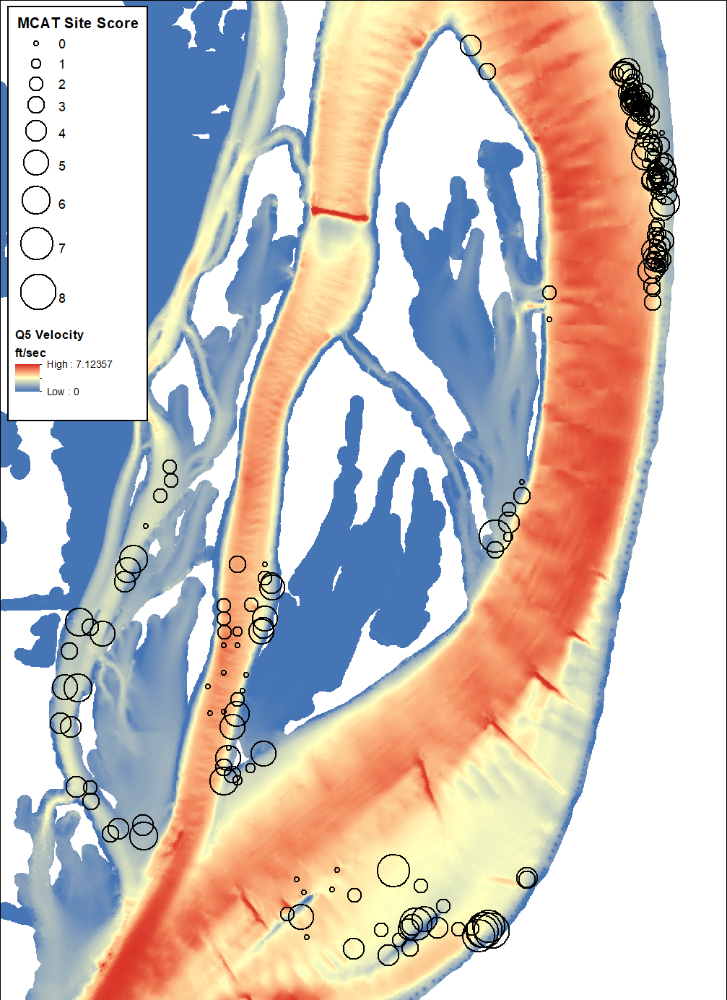

# Explore MCAT Metrics
This chapter will explore the MCAT metrics to determine if relationships exist between predictor variables and MCAT metrics.

```{r message=FALSE, warning=FALSE, include=FALSE}
# Load libraries
library(sp)
library(ggplot2)
library(dplyr)
library(tidyr)
library(knitr)
library(kableExtra)
library(arcgisbinding)

# Check for ArcGIS license
arc.check_product()

# Define some ArcGIS helper functions

# Converts ArcGIS feature class to an sp object
arc2sp <- function(fc_path) {
  # Open a connection to the specified ArcGIS feature class
  arcobj <- arcgisbinding::arc.open(fc_path)
  # Select the ArcGIS data
  arc <- arcgisbinding::arc.select(arcobj)
  # Convert the ArcGIS format to the sp format
  sp <- arcgisbinding::arc.data2sp(arc)
}

# Converts an sp object to an ArcGIS feature class
sp2arc <- function(sp_object, fc_path) {
  # Convert the sp object to an ArcGIS data object
  arcobj <- arcgisbinding::arc.sp2data(sp_object)
  # Write the ArcGIS object to a geodatabase feature class
  arcgisbinding::arc.write(data = arcobj, path = fc_path)
}
```

## MCAT Metric Site Threshold
The purpose of this section is to display the range of calculated values for each of the MCAT metrics for each of the sites in the Steamboat Island study area. The MCAT report is clear about metric thresholds to use for evaluating quality mussel beds. However, this study is using the individual site unit of analysis. Therefore, decisions must be made on what is the appropriate metric threshold to use for the site level of analysis. The descriptive statistics in this section will help to inform that decision. 


```{r message=FALSE, warning=FALSE, include=FALSE}
### Import MCAT Metrics from geodatabase

## Percent Listed
percent_listed_sp <- arc2sp("//mvrdfs/EGIS/Work/EMP/HREP_Projects/SteamboatSlough/Mussels/SteamboatMusselModel/Data/SB_Mussels.gdb/SB_ILStatePlaneW/PercentListed")

# Convert sp object to a data frame
percent_listed <- percent_listed_sp@data

## Percent Tolerant
percent_tolerant_sp <- arc2sp("//mvrdfs/EGIS/Work/EMP/HREP_Projects/SteamboatSlough/Mussels/SteamboatMusselModel/Data/SB_Mussels.gdb/SB_ILStatePlaneW/PercentTolerant")

# Convert sp object to a data frame
percent_tolerant <- percent_tolerant_sp@data

## Percent Tribe Lampsilini
percent_lamp_sp <- arc2sp("//mvrdfs/EGIS/Work/EMP/HREP_Projects/SteamboatSlough/Mussels/SteamboatMusselModel/Data/SB_Mussels.gdb/SB_ILStatePlaneW/PercentLampsilini")

# Convert sp object to a data frame
percent_lamp <- percent_lamp_sp@data

## Percent Juveniles
percent_juv_sp <- arc2sp("//mvrdfs/EGIS/Work/EMP/HREP_Projects/SteamboatSlough/Mussels/SteamboatMusselModel/Data/SB_Mussels.gdb/SB_ILStatePlaneW/PercentJuvenile")

# Convert sp object to a data frame
percent_juv <- percent_juv_sp@data

## Percent over 15 years
percent_over15_sp <- arc2sp("//mvrdfs/EGIS/Work/EMP/HREP_Projects/SteamboatSlough/Mussels/SteamboatMusselModel/Data/SB_Mussels.gdb/SB_ILStatePlaneW/PercentOver15yrs")

# Convert sp object to a data frame
percent_over15 <- percent_over15_sp@data

## Abundance
abund_sp <- arc2sp("//mvrdfs/EGIS/Work/EMP/HREP_Projects/SteamboatSlough/Mussels/SteamboatMusselModel/Data/SB_Mussels.gdb/SB_ILStatePlaneW/sample_abundance")

# Convert sp object to a data frame
abund <- abund_sp@data

## Species Evenness
species_pielou_sp <- arc2sp("//mvrdfs/EGIS/Work/EMP/HREP_Projects/SteamboatSlough/Mussels/SteamboatMusselModel/Data/SB_Mussels.gdb/SB_ILStatePlaneW/species_pielou")

# Convert sp object to a data frame
species_pielou <- species_pielou_sp@data

## Tribe Evenness
tribe_pielou_sp <- arc2sp("//mvrdfs/EGIS/Work/EMP/HREP_Projects/SteamboatSlough/Mussels/SteamboatMusselModel/Data/SB_Mussels.gdb/SB_ILStatePlaneW/tribe_pielou")

# Convert sp object to a data frame
tribe_pielou <- tribe_pielou_sp@data

## ES_100
rarefy_samples_sp <- arc2sp("//mvrdfs/EGIS/Work/EMP/HREP_Projects/SteamboatSlough/Mussels/SteamboatMusselModel/Data/SB_Mussels.gdb/SB_ILStatePlaneW/rarefy_samples")

# Convert sp object to a data frame
rarefy_samples <- rarefy_samples_sp@data

```

### Percent Listed
```{r echo=FALSE, fig.height=3, fig.width=6.5}
percent_listed_p <- ggplot(percent_listed, aes(Perc_listed)) + 
  geom_histogram(binwidth = 5) + 
  geom_vline(xintercept = 3, color = "red", size = 1.5)
print(percent_listed_p)
```

### Percent Tolerant
```{r echo=FALSE, fig.height=3, fig.width=6.5}
percent_tolerant_p <- ggplot(percent_tolerant, aes(Perc_tolerant)) + 
  geom_histogram(binwidth = 5) + 
  geom_vline(xintercept = 40, color = "red", size = 1.5)
print(percent_tolerant_p)
```

### Percent Tribe Lampsilini
```{r echo=FALSE, fig.height=3, fig.width=6.5}
percent_lamp_p <- ggplot(percent_lamp, aes(perc_lampsilini)) + 
  geom_histogram(binwidth = 5) + 
  geom_vline(xintercept = 40, color = "red", size = 1.5)
print(percent_lamp_p)
```

### Percent Juveniles
```{r echo=FALSE, fig.height=3, fig.width=6.5}
percent_juv_p <- ggplot(percent_juv, aes(Perc_juvenile)) + 
  geom_histogram(binwidth = 5) + 
  geom_vline(xintercept = 50, color = "red", size = 1.5)
print(percent_juv_p)
```

### Percent over 15 years
```{r echo=FALSE, fig.height=3, fig.width=6.5}
percent_over15_p <- ggplot(percent_over15, aes(Perc_over_15yrs)) + 
  geom_histogram(binwidth = 5) + 
  geom_vline(xintercept = 5, color = "red", size = 1.5)
print(percent_over15_p)
```

### Abundance
```{r echo=FALSE, fig.height=3, fig.width=6.5}
abundance_p <- ggplot(abund, aes(num_sq_m)) + 
  geom_histogram(binwidth = 5) + 
  geom_vline(xintercept = 13, color = "red", size = 1.5)
print(abundance_p)
```

### Species Evenness
```{r echo=FALSE, fig.height=3, fig.width=6.5}
species_pielou_p <- ggplot(species_pielou, aes(MEAN_pielou_evenness)) + 
  geom_histogram(bins = 40) + 
  geom_vline(xintercept = 0.7, color = "red", size = 1.5)
print(species_pielou_p)
```

### Tribe Evenness
```{r echo=FALSE, fig.height=3, fig.width=6.5}
tribe_pielou_p <- ggplot(tribe_pielou, aes(MEAN_tribe_pielou_evenness)) + 
  geom_histogram(bins = 40) + 
  geom_vline(xintercept = 0.8, color = "red", size = 1.5)
print(tribe_pielou_p)
```

### ES_100
```{r echo=FALSE, fig.height=3, fig.width=6.5}
rarefy_samples_p <- ggplot(rarefy_samples, aes(MEAN_rarefy_es_100)) + 
  geom_histogram(binwidth = 1) + 
  geom_vline(xintercept = 3, color = "red", size = 1.5)
print(rarefy_samples_p)
```


## MCAT Site Scores
The purpose of this step is to explore relationships between the MCAT Site Score and the hydraulic environmental predictors. 

```{r echo=FALSE, fig.cap="MCAT Site Scores with Velocity."}

```


```{r message=FALSE, warning=FALSE, include=FALSE}
# Import ArcGIS feature class into R
samples_mcat_sp <- arc2sp("//mvrdfs/EGIS/Work/EMP/HREP_Projects/SteamboatSlough/Mussels/SteamboatMusselModel/Data/SB_Mussels.gdb/SB_ILStatePlaneW/samples_mcat")

# Convert sp object to a data frame
samples_mcat <- samples_mcat_sp@data

```

```{r message=FALSE, warning=FALSE, include=FALSE}
# Import ArcGIS feature class into R
background_sp <- arc2sp("//mvrdfs/EGIS/Work/EMP/HREP_Projects/SteamboatSlough/Mussels/SteamboatMusselModel/Data/SB_Mussels.gdb/background")

# Convert sp object to a data frame
background <- background_sp@data

```

```{r message=FALSE, warning=FALSE, include=FALSE}
# Create a data frame for graphing MCAT Site Scores with background
## Select just the needed field
samples_mcat_graph <- samples_mcat[, c("mcat_site_score", "q5_velocity", 
                                       "q5_ss", "q5_reynolds", "q5_froude", 
                                       "q5_depth", "q5_slope",  "q95_velocity", 
                                       "q95_ss", "q95_reynolds", "q95_froude", 
                                       "q95_depth", "q95_slope")]
## Convert `mcat_site_score` to a factor
samples_mcat_graph$mcat_site_score <- factor(samples_mcat_graph$mcat_site_score)

## Create an `mcat_site_score` field
background$mcat_site_score <- rep("background", times = nrow(background))

## Select just the needed fields
backgound_graph <- background[, c("mcat_site_score", "q5_velocity", 
                                  "q5_ss", "q5_reynolds", "q5_froude", 
                                  "q5_depth", "q5_slope",  "q95_velocity", 
                                  "q95_ss", "q95_reynolds", "q95_froude", 
                                  "q95_depth", "q95_slope")]

# Combine samples_mcat and background
mcat_background <- rbind(samples_mcat_graph, backgound_graph)
mcat_background$mcat_site_score <- factor(mcat_background$mcat_site_score, 
                                          levels = c("background", "0", "1", "2", 
                                                     "3", "4", "5", "6", "7", "8"),
                                          ordered = TRUE)

# Convert from wide to long format for graphing
mcat_background_long <- gather(mcat_background, 
                               key = "predictor",
                               value = "value",
                               q5_velocity, q5_ss, q5_reynolds, q5_froude, 
                               q5_depth, q5_slope,  q95_velocity, 
                               q95_ss, q95_reynolds, q95_froude, 
                               q95_depth, q95_slope)
```


## MCAT Site Score by Velocity
```{r echo=FALSE, fig.height=4, fig.width=6.5}
ggplot(mcat_background_long[mcat_background_long$predictor == "q5_velocity", ], 
       aes(mcat_site_score, value)) + 
  geom_boxplot(varwidth = FALSE, outlier.shape = 1) + 
  theme_bw() +
  labs(x = "MCAT Site Score", y = "Q5 Velocity (ft/sec)")
```

```{r echo=FALSE, fig.height=4, fig.width=6.5}
ggplot(mcat_background_long[mcat_background_long$predictor == "q95_velocity", ], 
       aes(mcat_site_score, value)) + 
  geom_boxplot(varwidth = FALSE, outlier.shape = 1) + 
  theme_bw() +
  labs(x = "MCAT Site Score", y = "Q95 Velocity (ft/sec)")
```


## MCAT Site Score by Shear Stress
```{r echo=FALSE, fig.height=4, fig.width=6.5}
ggplot(mcat_background_long[mcat_background_long$predictor == "q5_ss", ], 
       aes(mcat_site_score, value)) + 
  geom_boxplot(varwidth = FALSE, outlier.shape = 1) + 
  theme_bw() +
  labs(x = "MCAT Site Score", y = "Q5 Shear Stress (Pa)")
```

```{r echo=FALSE, fig.height=4, fig.width=6.5}
ggplot(mcat_background_long[mcat_background_long$predictor == "q95_ss", ], 
       aes(mcat_site_score, value)) + 
  geom_boxplot(varwidth = FALSE, outlier.shape = 1) + 
  theme_bw() +
  labs(x = "MCAT Site Score", y = "Q95 Shear Stress (Pa)")
```

## MCAT Site Score by Reynolds Number
```{r echo=FALSE, fig.height=4, fig.width=6.5}
ggplot(mcat_background_long[mcat_background_long$predictor == "q5_reynolds", ], 
       aes(mcat_site_score, value)) + 
  geom_boxplot(varwidth = FALSE, outlier.shape = 1) + 
  theme_bw() +
  labs(x = "MCAT Site Score", y = "Q5 Reynolds number")
```

```{r echo=FALSE, fig.height=4, fig.width=6.5}
ggplot(mcat_background_long[mcat_background_long$predictor == "q95_reynolds", ], 
       aes(mcat_site_score, value)) + 
  geom_boxplot(varwidth = FALSE, outlier.shape = 1) + 
  theme_bw() +
  labs(x = "MCAT Site Score", y = "Q95 Reynolds number")
```

## MCAT Site Score by Froude Number
```{r echo=FALSE, fig.height=4, fig.width=6.5}
ggplot(mcat_background_long[mcat_background_long$predictor == "q5_froude", ], 
       aes(mcat_site_score, value)) + 
  geom_boxplot(varwidth = FALSE, outlier.shape = 1) + 
  theme_bw() +
  labs(x = "MCAT Site Score", y = "Q5 Froude number")
```

```{r echo=FALSE, fig.height=4, fig.width=6.5}
ggplot(mcat_background_long[mcat_background_long$predictor == "q95_froude", ], 
       aes(mcat_site_score, value)) + 
  geom_boxplot(varwidth = FALSE, outlier.shape = 1) + 
  theme_bw() +
  labs(x = "MCAT Site Score", y = "Q95 Froude number")
```

## MCAT Site Score by Depth
```{r echo=FALSE, fig.height=4, fig.width=6.5}
ggplot(mcat_background_long[mcat_background_long$predictor == "q5_depth", ], 
       aes(mcat_site_score, value)) + 
  geom_boxplot(varwidth = FALSE, outlier.shape = 1) + 
  theme_bw() +
  labs(x = "MCAT Site Score", y = "Q5 Depth (feet)")
```

```{r echo=FALSE, fig.height=4, fig.width=6.5}
ggplot(mcat_background_long[mcat_background_long$predictor == "q95_depth", ], 
       aes(mcat_site_score, value)) + 
  geom_boxplot(varwidth = FALSE, outlier.shape = 1) + 
  theme_bw() +
  labs(x = "MCAT Site Score", y = "Q95 Depth (feet)")
```

## MCAT Site Score by Slope
```{r echo=FALSE, fig.height=4, fig.width=6.5}
ggplot(mcat_background_long[mcat_background_long$predictor == "q5_slope", ], 
       aes(mcat_site_score, value)) + 
  geom_boxplot(varwidth = FALSE, outlier.shape = 1) + 
  theme_bw() +
  labs(x = "MCAT Site Score", y = "Q5 Slope (percent)")
```

```{r echo=FALSE, fig.height=4, fig.width=6.5}
ggplot(mcat_background_long[mcat_background_long$predictor == "q95_slope", ], 
       aes(mcat_site_score, value)) + 
  geom_boxplot(varwidth = FALSE, outlier.shape = 1) + 
  theme_bw() +
  labs(x = "MCAT Site Score", y = "Q95 Slope (percent)")
```


```{r message=FALSE, warning=FALSE, include=FALSE}
samples_mcat_summary <- samples_mcat %>% 
                        group_by(mcat_site_score) %>% 
                        summarize(q5_velocity_mean = mean(q5_velocity), 
                                  q5_ss_mean       = mean(q5_ss),
                                  q5_reynolds_mean = mean(q5_reynolds),
                                  q5_froude_mean   = mean(q5_froude),
                                  q5_depth_mean    = mean(q5_depth),
                                  q5_slope_mean    = mean(q5_slope),
                                  q95_velocity_mean = mean(q95_velocity), 
                                  q95_ss_mean       = mean(q95_ss),
                                  q95_reynolds_mean = mean(q95_reynolds),
                                  q95_froude_mean   = mean(q95_froude),
                                  q95_depth_mean    = mean(q95_depth),
                                  q95_slope_mean    = mean(q95_slope))
```

```{r message=FALSE, warning=FALSE, include=FALSE}
background_summary <- background %>% 
                      group_by(species) %>% 
                      summarize(q5_velocity_mean = mean(q5_velocity), 
                                q5_ss_mean       = mean(q5_ss),
                                q5_reynolds_mean = mean(q5_reynolds),
                                q5_froude_mean   = mean(q5_froude),
                                q5_depth_mean    = mean(q5_depth),
                                q5_slope_mean    = mean(q5_slope),
                                q95_velocity_mean = mean(q95_velocity), 
                                q95_ss_mean       = mean(q95_ss),
                                q95_reynolds_mean = mean(q95_reynolds),
                                q95_froude_mean   = mean(q95_froude),
                                q95_depth_mean    = mean(q95_depth),
                                q95_slope_mean    = mean(q95_slope))
```

