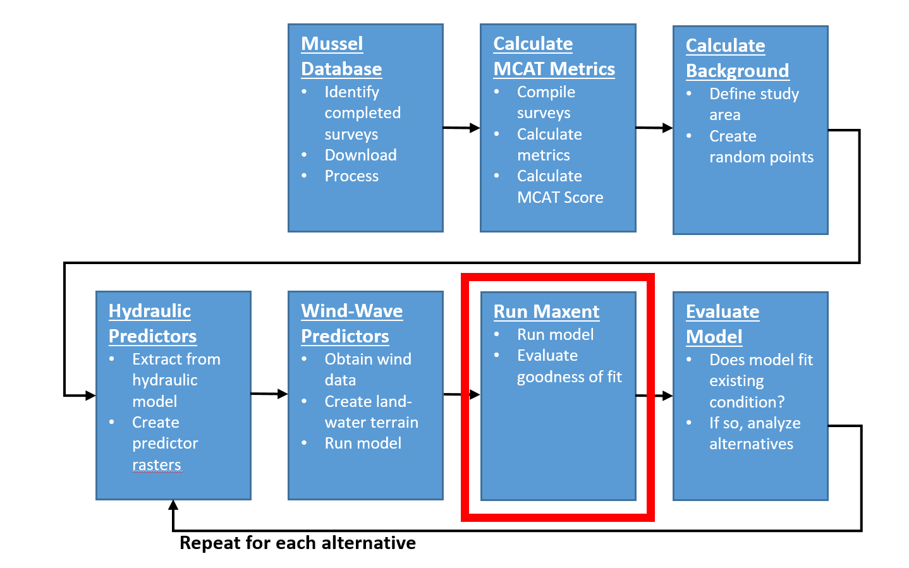

# Develop Maxent Mussel Model
This chapter will describe the process used to configure and run the [Maxent](https://biodiversityinformatics.amnh.org/open_source/maxent/) model [@phillips2017opening]. 

```{r echo=FALSE, fig.cap="HREP Mussel Modeling Workflow, Run Maxent Step."}

```

## Download the Maxent Software
The purpose of this section is to describe the process for downloading and configuring the Maxent software. 

<<add further Maxent configuration instructions here>>


## Convert predictors from `.bil` to `.mxe` format
The purpose of this step is to describe how to convert a raster format that ESRI products can read to a raster format the Maxent can read and write effeciently. To speed model creation (from 10's of hours to 10's of minutes), convert the predictors from the `.bil` format to the Maxent `.mxe` format.

* Open command prompt and change to the working directory. Change to the correct drive if necessary by typing `c:`. Then used `cd C:\Users\b6pdpdem\Documents\SteamboatMusselModel` to change to your local working directory. 
* In the working directory, create an `input_bil` folder. Copy the `.bil` format predictor rasters created in previous chapters into this folder. 
* In the working directory, create an `input_mxe` folder. 

```java -Xmx5g -cp maxent.jar density.Convert C:\Users\b6pdpdem\Documents\SteamboatMusselModel\input_bil bil C:\Users\b6pdpdem\Documents\SteamboatMusselModel\input_mxe mxe```


## Run Maxent
The purpose of this section is to describe the process of configuring the Maxent model. 

<<add further Maxent configuration instructions here>>


## Convert model output from `.mxe` back to `bil` format
The purpose of this step is to describe how to convert a raster in the Maxent `.mxe` format back to the `.bil` format that can be read by ESRI. 

```java -Xmx5g -cp maxent.jar density.Convert C:\Users\b6pdpdem\Documents\SteamboatMusselModel\sb_existing_20181203_2 mxe C:\Users\b6pdpdem\Documents\SteamboatMusselModel\sb_existing_20181203_2 bil```

* Use the `Define Projection` tool to set the projection of the `.bil` rasters. 

## Maxent speed Issues
Follow these simple performance guidelines to reduce Maxent run time from a week to half an hour. 

* Run the model on a physical computer, not on a virtual machine. 
* Select a computer with the fastest processor and most memory available. 
* Increase the memory available to the java virtual machine (JVM). Edit the first line of the `maxent.bat` file to something like the following: `java -Xmx5g -jar maxent.jar`, where the `-Xmx` parameter sets the maximum heap size for the JVM. Set it to something less than the total amount of physical memory on your computer. 
* Do not run the model across the LAN (inputs and outputs stored on a network file system). Copy all inputs and write all outputs to the local file system.
* Use a solid state drive for storing inputs and outputs. 
* Use the "SWD" format for specifying both samples (species occurances) and environmental layers (background points). 
* Convert all predictor grids to the Maxent `.mxe` format. 
* Write all outputs to the Maxent `.mxe` format. 
* Set the `threads` parameter to at least the number of cores on your computer (or a large percentage of logical processors) to speed processing of replicates. 


