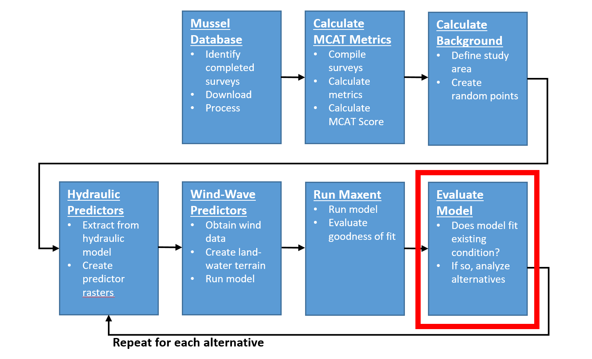

# Evaulate Model
This chapter will describe how to evaluate how well the existing condition model fits the mussel data for the study area.  

```{r echo=FALSE, fig.cap="HREP Mussel Modeling Workflow, Evaluate Model Step."}

```

## Goodness of Fit
The goodness of fit of the [existing condition model results](model_output/existing_condition/mcat.html) can be determined using the Area Under the Curve (AUC) of the Receiver Operating Characteristic (ROC). 

```{r echo=FALSE, fig.width=6.5, fig.cap="Existing Condition Model Receiver Operating Characteristic Curve."}
include_graphics("model_output/existing_condition/plots/mcat_roc.png")
```